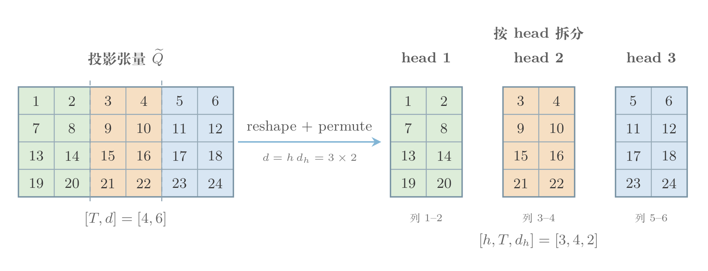

# Transformer Tensor Viz

一个专门绘制 Transformer 张量与矩阵运算图的个人 Codex Skill。它关注 Q/K/V 投影、多头拆分、reshape、permute、transpose、attention matmul、mask、softmax、concat、broadcast 和 reduction，而不是泛用流程图。

输出以可编辑 TikZ 为主，并同时交付 PDF 与 PNG。默认图面简洁：不显示公式区、不显示底部说明、不在单元格写数字，也不添加作者署名、水印或 Logo。



## 主要特性

- 形状优先：相同 shape 使用相同几何尺寸，reshape、transpose、split、concat 必须保持真实的维度关系。
- 颜色有语义：颜色表示 head、shard 或轴分区，并在变换前后保持一一对应，不作为随机装饰。
- 专项模板：内置横向 Q/K/V 投影与多头拆分模板。
- 三个独立开关：`formula`、`description`、`cell_values`，默认全部关闭。
- 可编辑交付：优先生成 TikZ，同时渲染 PDF 和 PNG 做视觉检查。
- 无图内署名：除非用户明确要求，否则不添加作者名、社交账号、水印、Logo 或 attribution line。

## 安装

直接克隆到 Codex 的个人 Skill 目录：

```bash
git clone https://github.com/yuzheng310/transformer-tensor-viz.git ~/.codex/skills/transformer-tensor-viz
```

如果目录已经存在，进入目录执行 `git pull` 即可更新。新建一个 Codex 会话后，Skill 会以 `$transformer-tensor-viz` 调用。

## 使用

默认模式：

```text
$transformer-tensor-viz 画 Q/K/V 投影和多头 reshape。
```

显示公式与底部维度说明：

```text
$transformer-tensor-viz 画 scaled dot-product attention；formula=on；description=on。
```

显示给定矩阵数值：

```text
$transformer-tensor-viz 根据下面的 attention 数值绘图；cell_values=on：[[...], [...]]
```

生成演示数字而非真实数据：

```text
$transformer-tensor-viz 画一个带演示数字的三头拆分例子；cell_values=on。
```

演示数字必须在交付说明中明确标注为 illustrative，不能让读者误以为它们是真实模型激活值。

## 三项开关

| 选项 | 默认值 | 开启后的效果 |
|---|---:|---|
| `formula` | `off` | 在计算图上方增加紧凑公式区 |
| `description` | `off` | 在计算图下方增加轴、对象与机制说明 |
| `cell_values` | `off` | 在完整可见的矩阵单元格中写入数值或符号 |

关闭的区域不会保留空白，最终画布会重新自然裁切。

## 颜色与拆分规则

颜色必须对应具体的 head、shard 或轴分区。例如默认三头模板使用 `d=6, h=3, d_h=2`：

| 投影后列区间 | 颜色 | 输出 |
|---|---|---|
| 第 1–2 列 | 绿色 `#DDEDD9` | head 1 |
| 第 3–4 列 | 橙色 `#F6DFC3` | head 2 |
| 第 5–6 列 | 蓝色 `#D8E6F3` | head 3 |

输入张量在 head 身份产生之前使用中性色。经过 reshape 或 permute 后，数值可以改变位置，但不能改变其所属颜色。若需要显示每个 head 的数字，应使用分离面板，避免叠片遮挡。

## 仓库结构

```text
.
├── SKILL.md
├── agents/openai.yaml
├── assets/
│   ├── qkv-horizontal-template.tex
│   └── reference-transformer-matrix-style.png
├── references/option-contract.md
└── examples/q-head-split-numeric/
    ├── q-head-split-numeric.tex
    ├── q-head-split-numeric.pdf
    └── q-head-split-numeric.png
```

`SKILL.md` 是行为规范的唯一入口；条件性细节放在 `references/`；可复用模板与视觉参考放在 `assets/`；可运行、可比较的结果放在 `examples/`。

## 开发与验证

建议使用 feature branch 开发，并以语义化版本打 tag：

- PATCH：样式微调、排版修复、文档修订。
- MINOR：新增一种 Transformer 运算模板或兼容输出。
- MAJOR：选项契约、目录结构或调用方式发生不兼容变化。

修改后至少完成以下检查：

```bash
uv run --with pyyaml python ~/.codex/skills/.system/skill-creator/scripts/quick_validate.py .
tectonic assets/qkv-horizontal-template.tex
tectonic examples/q-head-split-numeric/q-head-split-numeric.tex
```

还需要人工检查渲染 PNG：shape 是否一致、轴顺序是否正确、颜色映射是否连续、文字是否重叠、关闭区域是否留下空白，以及是否意外出现署名。

## 版本策略

- `main` 始终保持可安装、可验证。
- 每次可见行为变化都更新 `CHANGELOG.md`。
- 发布使用 `vX.Y.Z` tag；首个版本为 `v0.1.0`。
- 示例输出与源 `.tex` 一同提交，使视觉回归可以直接比较。

## 许可证与来源

本项目使用 [GPL-3.0](LICENSE)。它是 [`wdkns/wdkns-skills`](https://github.com/wdkns/wdkns-skills) 中 `tensor-formula-viz` 的个人化衍生版本，并针对 Transformer 张量运算、固定视觉模板和可选展示区域进行了专项裁剪。

许可证与上游说明只存在于仓库文档中，不会自动出现在生成的图里。
